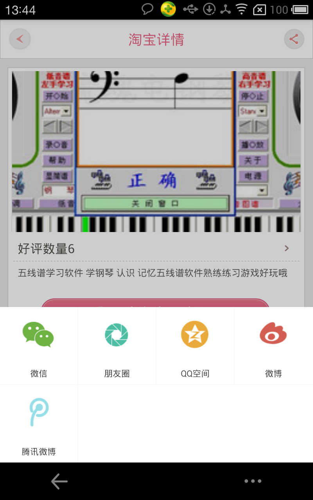

CuzySDK-Android-Studio
=======================

###介绍

CuzySDK是一个为移动开发者提供的淘宝客模块的平台，通过使用CuzySDK可获取淘宝、京东及各大团购网站的推广商品数据。

开发者在自己的iOS或Android APP中插入CuzySDK，即可向用户展示经过筛选和处理的优质推广商品数据。用户完成商品的购买后，开发者就可从中获取推广费用，从而达到流量变现的目的。开发者还可以在网页端查看商品库和数据汇总，包括APP中的商品被浏览、转跳到淘宝和购买成功次数等。 CuzySDK由北京市因动思网络信息技术有限公司开发，旨在让开发者的APP流量更快更方便地变现。 CuzySDK是一个零件模块，为开发者省下搭服务器、抓数据、调试API等淘宝客要做的步骤，开发者用这个零件定制自己的商品柜，把流量转化为收入。

其官方的sdk 版本过于陈旧，遂花费周末时间谢了个粗糙的，希望朋友们指教。

*** 

### 框架说明

- 简单的实现了淘宝的4个接口
- 使用Velloy 网络请求 GSON 解析
- 实现了图片数据的误网缓存等等...
- 周末做了如下的demo。
- 由于个人时间原因,SDK的制作时间会推延，希望感兴趣同学fork，有时间合作分工多多交流

###TODO
京东的接口,SDK的稳定性。很多...

这里我简单的用volley 来作为api的请求，更好的使用android studio 编写

再来做一次淘宝客。

花了个周末简单给大家做了个demo。希望一起做淘宝客的朋友，把sdk做的更加好用起来方便自己方便他人。
基本框架都是用的之前的，UI嘛，额无耻的借鉴别人的。

###PIC
ps(下图的代码还没有上传，等作者完善好，上传上去)

## 1.png

## 2.png

## 3.png

## 4.png

